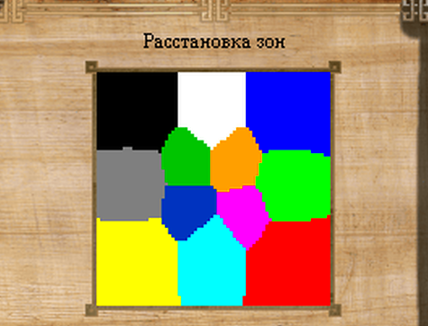

# Freedom
### Current version: 2.1.2
RMG template for slasher MNS, generates a random map of 72x72 size for 1v1 game.

### Zone placing:

## Zones are:
### Blue, yellow: players' starting zones.
#### Content:
- T1 town: artifact, item value 300-675, total value 675
- T2 town: banner or relic, item value 300-500, total value 500
- Ruins: relic, item value 300-500, 300-350 gold
- Ruins: permanent potion, item value 300-500, 300-350 gold
- Ruins: artifact, item value 600-800, 370-410 gold
- Merchant: orb, scroll, wand or talisman, item value 200-400, total value 4000
- Merchant: artifact, boots, banner, relic or talisman, item value 200-600, total value 5400
- Mage tower: T1 spells
> Bonus: T2 town in this zone also contains *1 potion of death call*.

> Bonus: T2 town guard in this zone also contains *1 scroll of speed*.

### White, green, cyan, grey: small side zones.
#### Content:
- T3 town: banner, boots or relic, item value 500-800, total value 800
- Ruins: banner, boots or relic, item value 500-800, 460-510 gold
- Ruins: banner, boots or relic, item value 500-800, 460-510 gold
- Merchant: permanent potion, item value 400-700, total value 3500
##### one of:
- Resource market: 3000 gold, 1000 each mana
- Mercenary: race T2 units
> Bonus: merchant in this zone also contains hero skill permanent potions.

> Bonus: one of the stacks in this zone contains *1 potion of mind rejuvenation*.

### Red, black: big corner zones.
#### Content:
- T2 town: permanent potion, item value 600-750, total value 750
- T4 town: banner, item value 1300-1500, total value 1500
- Ruins: *big orb of sorcery*, 300-350 gold
- Ruins: permanent potion, item value 900-1200, 300-350 gold
- Ruins: artifact, item value 950-1250, 320-370 gold
- Ruins: relic, item value 1000-1200, 320-370 gold
- Merchant: artifact, relic, banner or talisman, item value 700-900, total value 7200
- Mage tower: T1-T2 spells
- Trainer
- Mercenary: different random units
> Bonus: merchant in this zone also contains 3 permanent auras each of 700 value.

### Pink: central zone.
#### Content:
- T3 town: potion permanent, item value 600-750, total value 750
- T5 town: artifact, item value 1750-3000, total value 3000
- Ruins: *ambassador's potion*, gold 150-200
- Ruins: artifact, item value 1100-1400, gold 320-370
- Ruins: banner, item value 1500, gold 320-370
- Ruins: relic, item value 1000-1200, gold 320-370
- Ruins: *any of control artifacts*, gold 150-200
- Merchant: scroll, wand, item value 200-5500, total value 5500
- Merchant: artifact, boots, banner or relic, item value 500-900, total value 7200
- Mage tower: T1-T3 spells
> Bonus: one of the stacks in this zone contains permanent potion of 600-750 value.

> Bonus: merchant with scrolls and wands also contains *1 scroll of incorruptibility*, *1 scroll of swiftness*, *1 scroll of daylight*, *1 scroll of twilight*.

> Bonus: merchant with items also contains *1 talisman of thunder*, *1 talisman of hellfire*, *1 scroll of neutral summoning IV*, *1 orb of polymorph*, *1 orb of mass deceleration*.

## Path guards:
### From players' starting zones to small side zones:
##### one of:
- Leader Greenskin or Marsh: contains permanent potion, item value 450-650, total value 650
- Leader Barbarian: contains permanent potion, item value 450-650, total value 650
> Bonus: Also contains *1 scroll of speed*.

### From players' starting zones to central zone:
- Leader Dragon: contains artifact or talisman, item value 700-1000, total value 1000

### From small side zones to central zone:
- Leader Dragon: contains orb or talisman, item value 700-1000, total value 2000

### From small side zones to big corner zones:
- Leader Dragon: contains boots, item value 800-1100, total value 1100
> Bonus: Also contains *1 scroll of speed*.

### From big corner zones to central zone:
- Leader Dragon: contains relic, item value 700-1000, total value 1000